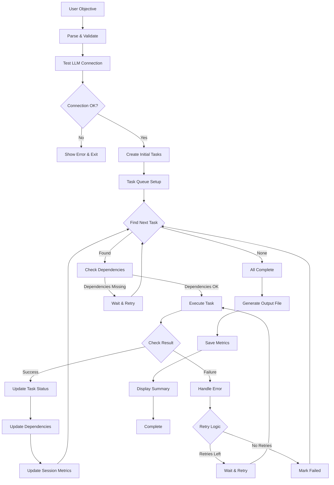
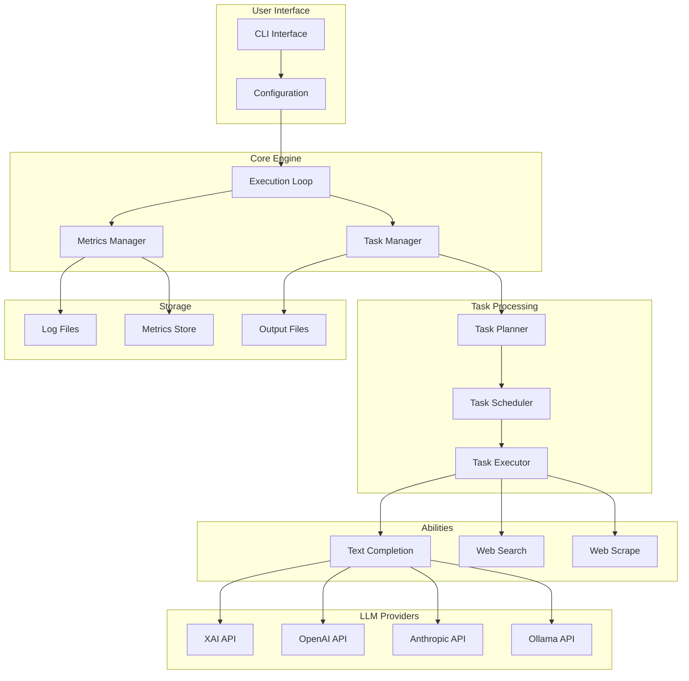
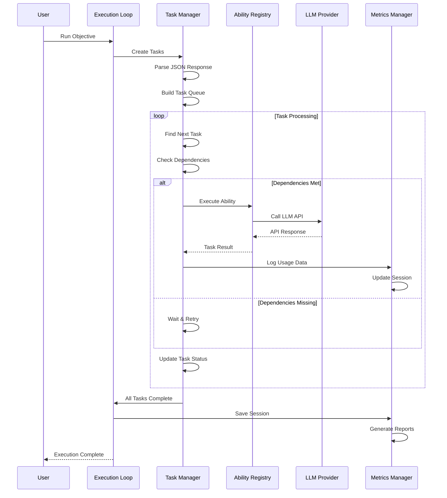

# ReasonLoop Architecture

A comprehensive guide to the ReasonLoop system architecture, execution flow, and multi-agent orchestration.

## 📋 Table of Contents

1. [System Overview](#system-overview)
2. [Core Architecture](#core-architecture)
3. [Execution Flow](#execution-flow)
4. [Multi-Agent Orchestration](#multi-agent-orchestration)
5. [Metrics Tracking System](#metrics-tracking-system)
6. [Data Flow Diagrams](#data-flow-diagrams)
7. [Component Details](#component-details)
8. [Configuration & Settings](#configuration--settings)
9. [Error Handling](#error-handling)
10. [Performance Considerations](#performance-considerations)

## 🎯 System Overview

ReasonLoop is a modular AI agent system that breaks down complex objectives into executable tasks and orchestrates their execution across multiple AI models and capabilities. The system provides real-time metrics tracking, multi-provider LLM support, and intelligent task orchestration.

### Key Characteristics

- **🤖 Autonomous Task Execution**: Automatically breaks down complex objectives into manageable tasks
- **📊 Real-Time Metrics**: Captures actual API usage, costs, and performance data
- **🔄 Multi-Provider Support**: Seamlessly switches between XAI, OpenAI, Anthropic, and Ollama
- **⚡ Async Architecture**: Concurrent task execution with proper resource management
- **🎯 Role-Based Models**: Optimizes model selection based on task type
- **🛡️ Production-Ready**: Comprehensive error handling and connection validation

## 🏗️ Core Architecture

```
┌─────────────────────────────────────────────────────────────────┐
│                        ReasonLoop System                        │
├─────────────────────────────────────────────────────────────────┤
│                                                                 │
│  ┌─────────────────┐  ┌─────────────────┐  ┌─────────────────┐   │
│  │   CLI Layer     │  │   Web Layer    │  │   API Gateway   │   │
│  │   (main.py)     │  │   (future)     │  │   (future)     │   │
│  └─────────────────┘  └─────────────────┘  └─────────────────┘   │
│           │                       │                       │       │
│           └───────────────────────┼───────────────────────┘       │
│                                   │                               │
│  ┌─────────────────────────────────┼─────────────────────────────────┐ │
│  │                     Core Engine                          │ │
│  │  ┌─────────────────┐  ┌─────────────────┐  ┌─────────────┐ │ │
│  │  │ Execution Loop  │  │ Task Manager   │  │ Metrics     │ │ │
│  │  │ (Orchestrator) │  │ (Scheduler)    │  │ Manager     │ │ │
│  │  └─────────────────┘  └─────────────────┘  └─────────────┘ │ │
│  └─────────────────────────────────┬───────────────────────────────┘ │
│                                    │                               │
│  ┌─────────────────────────────────┼─────────────────────────────────┐ │
│  │                     Ability Registry                      │ │
│  │  ┌─────────────┐ ┌─────────────┐ ┌─────────────┐ ┌─────────┐ │ │
│  │  │Text-Complete│ │ Web Search  │ │ Web Scrape  │ │   ...   │ │ │
│  │  │   Ability   │ │   Ability   │ │   Ability   │ │Abilities│ │ │
│  │  └─────────────┘ └─────────────┘ └─────────────┘ └─────────┘ │ │
│  └─────────────────────────────────┬───────────────────────────────┘ │
│                                    │                               │
│  ┌─────────────────────────────────┼─────────────────────────────────┐ │
│  │                    LLM Providers                      │ │
│  │  ┌─────────────┐ ┌─────────────┐ ┌─────────────┐ ┌─────────┐ │ │
│  │  │     XAI     │ │   OpenAI   │ │ Anthropic   │ │  Ollama │ │ │
│  │  │   (Grok)    │ │   (GPT)    │ │  (Claude)   │ │  (Local)│ │ │
│  │  └─────────────┘ └─────────────┘ └─────────────┘ └─────────┘ │ │
│  └─────────────────────────────────────────────────────────────────┘ │
└─────────────────────────────────────────────────────────────────┘
```

## 🔄 Execution Flow

### High-Level Process

```
┌─────────────┐    ┌─────────────┐    ┌─────────────┐    ┌─────────────┐
│ User Input  │ -> │ Task Planner │ -> │ Task Executor│ -> │ Result聚合 │
│  Objective  │    │   (LLM)     │    │  (Multi)   │    │   (Output)  │
└─────────────┘    └─────────────┘    └─────────────┘    └─────────────┘
       │                   │                   │                   │
       │                   │                   │                   │
       v                   v                   v                   v
┌─────────────┐    ┌─────────────┐    ┌─────────────┐    ┌─────────────┐
│ Validation   │    │ Dependency  │    │  Ability    │    │   Metrics   │
│ & Config     │    │ Resolution  │    │ Execution   │    │  Collection │
└─────────────┘    └─────────────┘    └─────────────┘    └─────────────┘
```

### Detailed Execution Loop



## 🤖 Multi-Agent Orchestration

### Role-Based Task Distribution

The system automatically determines the appropriate AI role based on task characteristics:

```
┌─────────────────────────────────────────────────────────────────┐
│                     Task Type Detection                        │
├─────────────────────────────────────────────────────────────────┤
│                                                                 │
│  Planning Keywords:    │  Execution Keywords:    │  Review Keywords:  │
│  - plan, design      │  - execute, implement │  - review, check │
│  - outline, structure│  - generate, write    │  - analyze, eval  │
│  - strategy          │  - create, produce    │  - validate, test  │
│                                                                 │
└─────────────────────────────────────────┬───────────────────────┘
                                          │
                                          v
┌─────────────────────────────────────────────────────────┐
│                    Role Assignment                      │
├─────────────────────────────────────────────────────────┤
│                                                         │
│  ┌─────────────┐    ┌─────────────┐    ┌─────────────┐  │
│  │ Orchestrator│    │   Planner   │    │  Executor   │  │
│  │ High-level  │    │ Task        │    │ Content     │  │
│  │ coordination│    │ breakdown   │    │ generation  │  │
│  │             │    │             │    │             │  │
│  │ • Strategy  │    │ • Analysis  │    │ • Writing   │  │
│  │ • Planning  │    │ • Structure │    │ • Creation  │  │
│  │ • Oversight │    │ • Logic     │    │ • Production│  │
│  └─────────────┘    └─────────────┘    └─────────────┘  │
│         │                 │                   │         │
│         └─────────────────┼───────────────────┘         │
│                           │                             │
│                    ┌─────────────┐                      │
│                    │   Reviewer  │                      │
│                    │ Validation  │                      │
│                    │ & Quality   │                      │
│                    │             │                      │
│                    │ • Analysis  │                      │
│                    │ • Feedback  │                      │
│                    │ • Validation│                      │
│                    └─────────────┘                      │
└─────────────────────────────────────────────────────────┘
```

### Model Selection Strategy

```python
# Automatic model selection based on role and complexity
def select_model_for_task(task_description: str, role: str) -> str:
    """Select optimal model based on task characteristics"""
    
    if role == "orchestrator":
        return get_setting(f"{provider.upper()}_MODEL_ORCHESTRATOR")
    elif role == "planner":
        return get_setting(f"{provider.upper()}_MODEL_PLANNER")
    elif role == "executor":
        return get_setting(f"{provider.upper()}_MODEL_EXECUTOR")
    elif role == "reviewer":
        return get_setting(f"{provider.upper()}_MODEL_REVIEWER")
    else:
        return get_setting(f"{provider.upper()}_MODEL")
```

## 📊 Metrics Tracking System

### Real-Time Data Collection

```
┌─────────────────────────────────────────────────────────────────┐
│                   Metrics Collection Pipeline                   │
├─────────────────────────────────────────────────────────────────┤
│                                                                 │
│  ┌─────────────┐    ┌─────────────┐    ┌─────────────┐        │
│  │   API       │    │    Cost     │    │ Performance │        │
│  │  Response   │    │ Calculation │    │  Tracking   │        │
│  └─────────────┘    └─────────────┘    └─────────────┘        │
│         │                   │                   │                │
│         └───────────────────┼───────────────────┘                │
│                             │                                │
│  ┌─────────────────────────────────────────────────────────────┐ │
│  │              Usage Data Extraction                       │ │
│  │  ┌─────────────┐ ┌─────────────┐ ┌─────────────┐      │ │
│  │  │ Token Count │ │  Cost USD   │ │ Response    │      │ │
│  │  │ (API/Est)   │ │ (API/Calc)  │ │ Time (ms)   │      │ │
│  │  └─────────────┘ └─────────────┘ └─────────────┘      │ │
│  └─────────────────────────────────┬───────────────────────────┘ │
│                                    │                           │
│  ┌─────────────────────────────────┼───────────────────────────┐ │
│  │           Session Manager       │                           │ │
│  │  ┌─────────────┐ ┌─────────────┐ ┌─────────────┐      │ │
│  │  │  Task ID    │ │   Status    │ │   Metrics   │      │ │
│  │  │ Generation  │ │ Tracking     │ │ Aggregation │      │ │
│  │  └─────────────┘ └─────────────┘ └─────────────┘      │ │
│  └─────────────────────────────────────────────────────────────┘ │
│                                    │                           │
│  ┌─────────────────────────────────┼───────────────────────────┐ │
│  │              Storage Layer       │                           │ │
│  │  ┌─────────────┐ ┌─────────────┐ ┌─────────────┐      │ │
│  │  │Prompt Logs │ │Session Data │ │ Performance │      │ │
│  │  │ (JSON)     │ │ (JSON)      │ │  Charts    │      │ │
│  │  └─────────────┘ └─────────────┘ └─────────────┘      │ │
│  └─────────────────────────────────────────────────────────────┘ │
└─────────────────────────────────────────────────────────────────┘
```

### Metrics Data Structure

```json
{
  "session_id": "session_1768555256",
  "start_time": 1768555256.9968798,
  "end_time": 1768555292.3058019,
  "duration_s": 35.30892205238342,
  "tasks": [
    {
      "task_id": 1,
      "task_type": "web-search",
      "execution": {
        "start_time": 1768555260.0,
        "end_time": 1768555262.0,
        "duration_ms": 2000.0
      },
      "tokens": {
        "prompt_tokens": 90,
        "completion_tokens": 66,
        "total_tokens": 156
      },
      "system": {
        "cpu_percent": 15.2,
        "memory_percent": 45.8,
        "memory_used_mb": 1024.5
      },
      "status": "completed"
    }
  ],
  "total_tokens": {
    "prompt_tokens": 407,
    "completion_tokens": 1173,
    "total_tokens": 1580
  }
}
```

## 🔄 Data Flow Diagrams

### Complete System Data Flow



### Task Execution Flow



## 🔧 Component Details

### Core Components

#### 1. Execution Loop (`core/execution_loop.py`)
- **Purpose**: Main orchestration and flow control
- **Responsibilities**:
  - Initialize task manager
  - Coordinate task execution cycles
  - Manage completion detection
  - Generate output files
  - Handle session lifecycle

```python
def run_execution_loop(objective: str) -> str:
    """Main execution loop and return result file path"""
    task_manager = TaskManager(objective)
    tasks = task_manager.create_initial_tasks()
    
    while True:
        next_task = task_manager.find_next_task()
        if not next_task:
            break  # All tasks complete
        
        result = task_manager.execute_task(next_task)
        # Process results and continue...
```

#### 2. Task Manager (`core/task_manager.py`)
- **Purpose**: Task breakdown, scheduling, and execution
- **Responsibilities**:
  - Parse LLM responses into executable tasks
  - Manage task dependencies
  - Schedule task execution
  - Track task status and results
  - Maintain session context

#### 3. Ability Registry (`abilities/ability_registry.py`)
- **Purpose**: Centralized ability management and execution
- **Responsibilities**:
  - Register new abilities
  - Route tasks to appropriate abilities
  - Handle error recovery
  - Collect execution metrics

#### 4. Metrics Manager (`utils/metrics.py`)
- **Purpose**: Comprehensive metrics collection and analysis
- **Responsibilities**:
  - Track session-level metrics
  - Collect task-level performance data
  - Calculate cost and efficiency metrics
  - Generate analytics reports

### Ability System

#### Text Completion Ability
```python
class XAIProvider:
    """XAI (Grok) provider implementation"""
    
    def complete(self, prompt: str, role: Optional[str] = None) -> Tuple[str, Dict]:
        """Execute completion and return response with usage data"""
        # API call with proper error handling
        # Real-time usage data extraction
        # Cost calculation
        # Metrics collection
        
    def get_usage(self, prompt: str, response: str, api_response: Dict) -> Dict[str, Any]:
        """Extract usage metrics from API response"""
        # Parse real API usage data
        # Calculate costs
        # Track performance metrics
```

#### Web Search Ability
```python
def web_search_ability(search_query: str) -> str:
    """Perform web search and return results"""
    # API integration with search providers
    # Result parsing and formatting
    # Error handling for API failures
```

### Provider Integration

#### Multi-Provider Support
```python
class ProviderFactory:
    """Factory to create appropriate provider instances"""
    
    _providers = {
        "xai": XAIProvider,
        "openai": OpenAIProvider,
        "anthropic": AnthropicProvider,
        "ollama": OllamaProvider,
    }
    
    @classmethod
    def get_provider(cls, provider_name: str) -> LLMProvider:
        """Get provider instance by name"""
        provider_class = cls._providers.get(provider_name.lower())
        if not provider_class:
            raise ValueError(f"Unknown LLM provider: {provider_name}")
        return provider_class()
```

## ⚙️ Configuration & Settings

### Environment-Based Configuration

```python
# config/settings.py
class Settings:
    """Settings manager - loads everything from .env file"""
    
    def __init__(self):
        self._settings = {}
        self._load_all_from_env()
        
    def _load_all_from_env(self):
        """Load ALL settings from environment variables"""
        # LLM Provider settings
        self._load_env_var("LLM_PROVIDER")
        self._load_env_var("LLM_TEMPERATURE", float)
        self._load_env_var("LLM_MAX_TOKENS", int)
        
        # Provider-specific settings
        self._load_env_var("XAI_API_KEY")
        self._load_env_var("XAI_MODEL")
        # ... more settings
```

### Configuration Structure
```env
# .env file example
LLM_PROVIDER=xai
XAI_API_KEY=your-api-key
XAI_MODEL=grok-4-1-fast-non-reasoning

# Role-based models
XAI_MODEL_ORCHESTRATOR=grok-4-1-fast-non-reasoning
XAI_MODEL_PLANNER=grok-4-1-fast-non-reasoning
XAI_MODEL_EXECUTOR=grok-4-1-fast-non-reasoning
XAI_MODEL_REVIEWER=grok-4-1-fast-non-reasoning

# General settings
LLM_TEMPERATURE=0.7
LLM_MAX_TOKENS=4096
MAX_RETRIES=3
RETRY_DELAY=2.0
```

## 🛡️ Error Handling

### Comprehensive Error Recovery

```python
class TaskManager:
    def execute_task_with_retry(self, task: Task, max_retries: int = 3) -> Result:
        """Execute task with retry logic and error recovery"""
        for attempt in range(max_retries):
            try:
                result = self.execute_task(task)
                if result.success:
                    return result
                else:
                    logger.warning(f"Task {task.id} failed: {result.error}")
            except Exception as e:
                logger.error(f"Task {task.id} attempt {attempt + 1} failed: {e}")
                
            if attempt < max_retries - 1:
                time.sleep(2 ** attempt)  # Exponential backoff
                
        # Mark as failed after all retries
        return Result(task_id=task.id, content="", success=False)
```

### Connection Validation
```python
def test_llm_service() -> tuple:
    """Test if LLM service is available and responding"""
    try:
        # Test API connection
        # Validate response format
        # Check rate limits
        # Return status and message
    except Exception as e:
        return False, f"Connection failed: {str(e)}"
```

## ⚡ Performance Considerations

### Async Architecture Benefits

1. **Concurrent Task Execution**: Multiple tasks can run simultaneously
2. **Non-Blocking I/O**: API calls don't block other operations
3. **Resource Optimization**: Better CPU and memory utilization
4. **Scalability**: Handle larger workloads efficiently

### Optimization Strategies

#### 1. Provider Selection
- **Fast Models**: For simple tasks requiring quick responses
- **Accurate Models**: For complex reasoning tasks
- **Cost-Effective**: Balance performance and cost

#### 2. Caching Implementation
```python
# Cached token pricing optimization
cached_cost = (cached_tokens / 1_000_000) * 0.05  # $0.05 per M for cached
```

#### 3. Metrics-Driven Optimization
- **Performance Benchmarking**: Compare provider efficiency
- **Cost Analysis**: Identify expensive operations
- **Usage Patterns**: Optimize for common workflows

### Performance Monitoring

```python
def calculate_performance_metrics(
    response_time_ms: int,
    token_estimate: TokenEstimate,
    cost_estimate: CostEstimate
) -> PerformanceMetrics:
    """Calculate comprehensive performance metrics"""
    tokens_per_second = (token_estimate.total_tokens / response_time_ms) * 1000
    cost_per_token = cost_estimate.total_cost / token_estimate.total_tokens
    efficiency_score = calculate_efficiency_score(tokens_per_second, cost_per_token)
    
    return PerformanceMetrics(
        tokens_per_second=tokens_per_second,
        response_time_ms=response_time_ms,
        cost_per_token=cost_per_token,
        efficiency_score=efficiency_score,
        throughput_tier=classify_throughput(tokens_per_second)
    )
```

## 📈 Scalability & Extensibility

### Adding New Abilities

```python
# 1. Create ability function
def my_custom_ability(prompt: str) -> str:
    """Custom ability implementation"""
    # Your logic here
    return result

# 2. Register ability
from abilities.ability_registry import register_ability
register_ability("my-custom", my_custom_ability)

# 3. Use in tasks
objective = "Use my custom ability to process this data"
```

### Adding New Providers

```python
class CustomProvider(LLMProvider):
    """Custom LLM provider implementation"""
    
    def complete(self, prompt: str, role: Optional[str] = None) -> Tuple[str, Dict]:
        # Implement provider-specific logic
        pass
        
    def get_usage(self, prompt: str, response: str, api_response: Dict) -> Dict[str, Any]:
        # Extract provider-specific usage data
        pass

# Register new provider
ProviderFactory._providers["custom"] = CustomProvider
```

### Template System Extension

```json
{
  "name": "my_template",
  "description": "My custom template for specific use cases",
  "system_message": "You are a specialized agent for...",
  "task_prompt": "Given this objective: {objective}...",
  "model_selection": {
    "planner": "gpt-4",
    "executor": "gpt-3.5-turbo",
    "reviewer": "claude-3"
  }
}
```

---

## 🎯 Conclusion

ReasonLoop's architecture provides a robust, scalable, and extensible platform for AI-powered task orchestration. The system's modular design allows for easy customization and enhancement while maintaining production-ready reliability and comprehensive metrics tracking.

### Key Architecture Strengths

- **🔄 Intelligent Orchestration**: Automatic task breakdown and dependency resolution
- **📊 Real-Time Analytics**: Comprehensive metrics with cost optimization insights
- **🔌 Provider Flexibility**: Seamless multi-provider support with automatic failover
- **⚡ Async Performance**: Concurrent execution with resource optimization
- **🛡️ Production Ready**: Comprehensive error handling and recovery mechanisms
- **📈 Scalable Design**: Easy extension with new abilities, providers, and templates

The architecture supports both simple automation workflows and complex multi-agent orchestration, making it suitable for a wide range of AI-powered applications.
